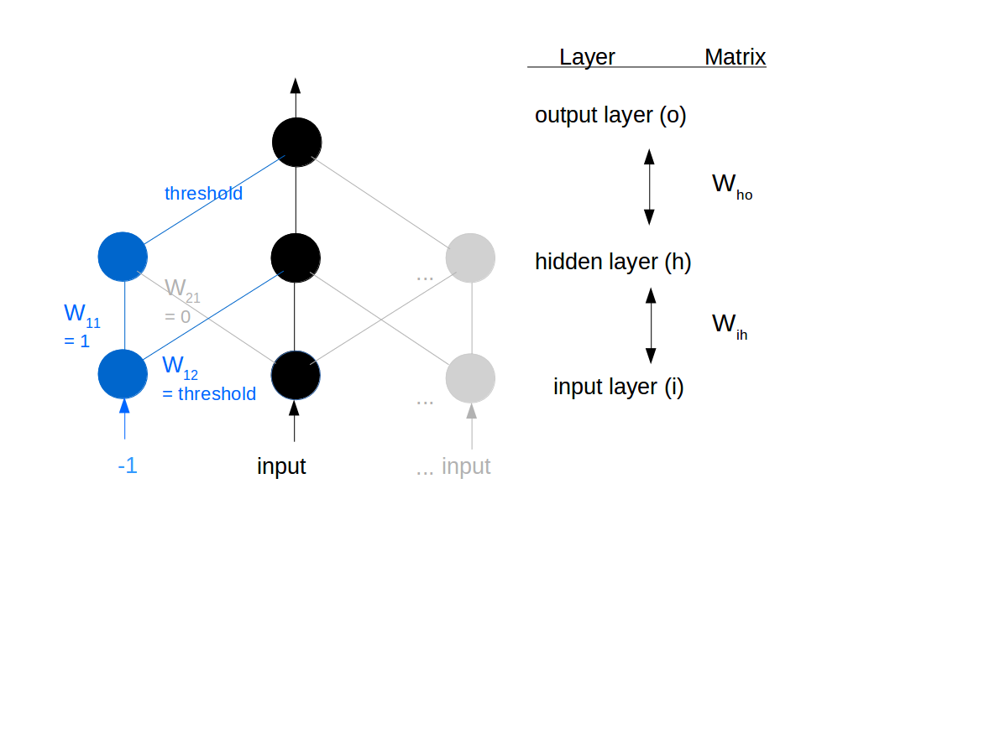

# Neural_Network
in Python

## 3-layer Back-propagation Neural Network
Reference: [*Make Your Own Neural Network*](https://github.com/makeyourownneuralnetwork/makeyourownneuralnetwork/blob/master/part2_neural_network.ipynb)

#### Basic Structure & Indexing


#### Back-propagation Training


Class:

```python
import numpy as np
import scipy.special  # sigmoid function expit()
import matplotlib.pyplot as plt

class neuralNetwork:
    
    def __init__(self, inputnodes, hiddennodes, outputnodes, learningrate):
        # numbers of nodes of each layer
        self.i = inputnodes + 1  # first input is for threshold
        self.j = hiddennodes
        self.k = outputnodes
        
        # --- Weight Matrix ----------------------------------------------
        # Wab: from node a to node b in the next layer
        # The input to the first input node is -1 (to generate thresholds)

        # [W11,W21, ...],
        # [W12,W22, ...],
        # ...

        # Initailizing the weight with "Xavier initialization"
        # Normal distribution with deviation = sqrt(1/#of nodes of previous layer)
        #self.wij = np.random.randn(self.j, self.i)*np.sqrt(1/self.i) 
        #self.wjk = np.random.randn(self.k, self.j)*np.sqrt(1/self.j) 
        
        self.wij = np.array([[1.0, 0.8, -0.1], [0, 0.2, -0.4], [0, 0.2, -0.2]]) 
        
        self.wjk = np.array([[0.3, 0.1, -0.4]])

        # ----------------------------------------------------------------

        # learning rate
        self.lr = learningrate
        
        # activation function: sigmoid 
        self.activation_function = lambda x: scipy.special.expit(x)
        
        pass


    # Please refer to "README" for formulations and indexing
    def train(self, inputs_list, targets_list):
        xi = np.array(inputs_list, ndmin=2).T  #input # convert list to 2d array
        targets = np.array(targets_list, ndmin=2).T
        
        xj = np.dot(self.wij, xi)
        yj = self.activation_function(xj)

        xk = np.dot(self.wjk, yj)
        yk = self.activation_function(xk)

        delta_k = (targets - yk) * yk * (1 - yk)  # (self.k x 1) element-wise multiplication
        
        # option 1: from "Make Your Own Neural Network" 
        #self.wjk += self.lr * np.dot(delta_k, np.transpose(yj))  
        #delta_j = np.dot(np.transpose(self.wjk), (targets - yk)) * yj * (1 - yj)  

        # option 2: from lecure notes
        self.wjk += self.lr * np.dot(delta_k, np.transpose(xj))  
        delta_j = np.dot(np.transpose(self.wjk), delta_k) * yj * (1 - yj)  

        self.wij += self.lr * np.dot(delta_j, np.transpose(xi))

        pass


    def query(self, inputs_list):
        xi = np.array(inputs_list, ndmin=2).T  #input # convert list to 2d array
        
        xj = np.dot(self.wij, xi)
        yj = self.activation_function(xj)

        xk = np.dot(self.wjk, yj)
        yk = self.activation_function(xk)
        
        return yk


    # train, test, plot
    def test(self, epoch, inputs_list, targets_list):  # list of inputs list, targets list
        # Add the threshold input
        for i in range(len(inputs_list)):
            inputs_list[i] = [-1] + inputs_list[i]

        # Plot the Sum-Squared Error - Epoch
        #plt.axis([0, epoch+1, 0, 1.1])
        plt.title('Sum-Squared Error - Epoch\n Learing Rate = ' + str(self.lr))
        plt.xlabel('Epoch')
        plt.ylabel('Sum-Squared Error')

        # Train & Plot
        for x in range(0, epoch):
            for i in range(len(inputs_list)):
                self.train(inputs_list[i], targets_list[i])  
            
            sum_squared_errors = 0

            for i in range(len(inputs_list)):
                sum_squared_errors += (self.query(inputs_list[i])-targets_list[i])**2

            plt.scatter(x+1, sum_squared_errors)

        plt.show()
```
Example: Solving the logical operation XOR (Exclusive-OR):

```python
def main():
    # train set
    inputs_list = []  # list of inputs list
    targets_list = []  # list of targets list

    # number of Epoch
    epoch = 1000

    # learning rate
    learing_rate = 1

    # Inputs & Targets
    inputs_list.append([-1, -1]); targets_list.append([0])
    inputs_list.append([-1, 1]); targets_list.append([1])
    inputs_list.append([1, -1]); targets_list.append([1])
    inputs_list.append([1, 1]); targets_list.append([0])

    # numbers of input nodes
    input_nodes = len(inputs_list[0])

    # numbers of hidden nodes (should >= input nodes)
    hidden_nodes = 2

    # numbers of output nodes
    output_nodes = len(targets_list[0])

    # Create an instance of neuralNetwork with the learning rate specified
    nn = neuralNetwork(input_nodes, hidden_nodes, output_nodes, learing_rate)

    # Train & Test & Plot sum-square errors
    nn.test(epoch, inputs_list, targets_list)
    
if __name__ == '__main__':
    main()
```

### NTU Course - Intelligent Control HW3


Solving the logical operation XOR (Exclusive-OR) using two structures above.

#### Thresholds are added as negative inputs



Convergence of sum-squared-error:


For details please refer to **HW3.pdf** and **hw3_x.py** 

